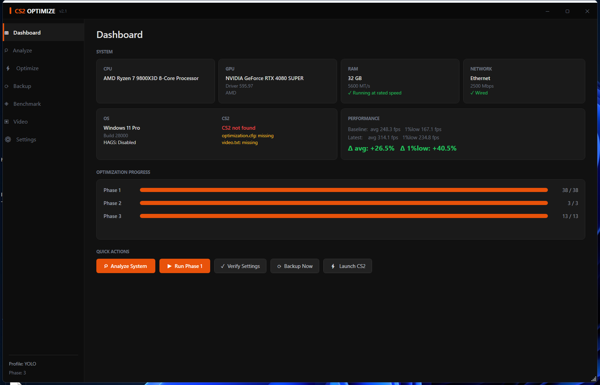
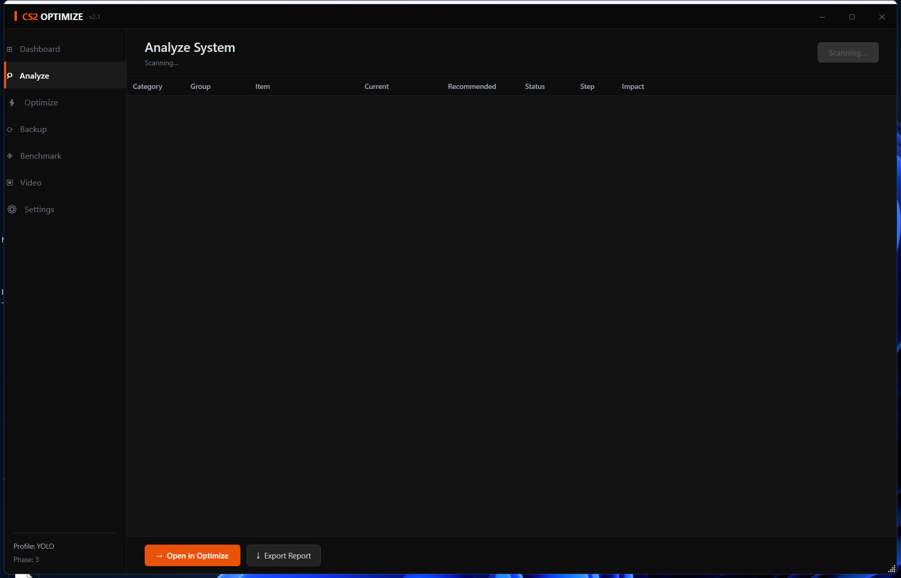
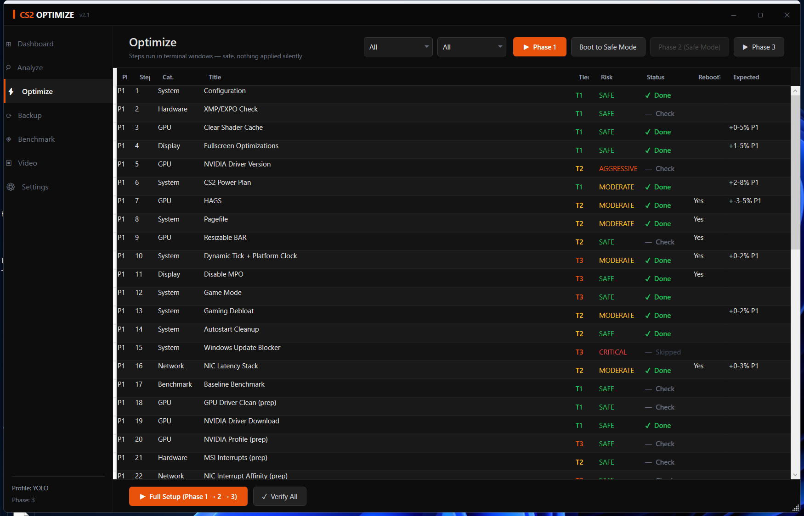
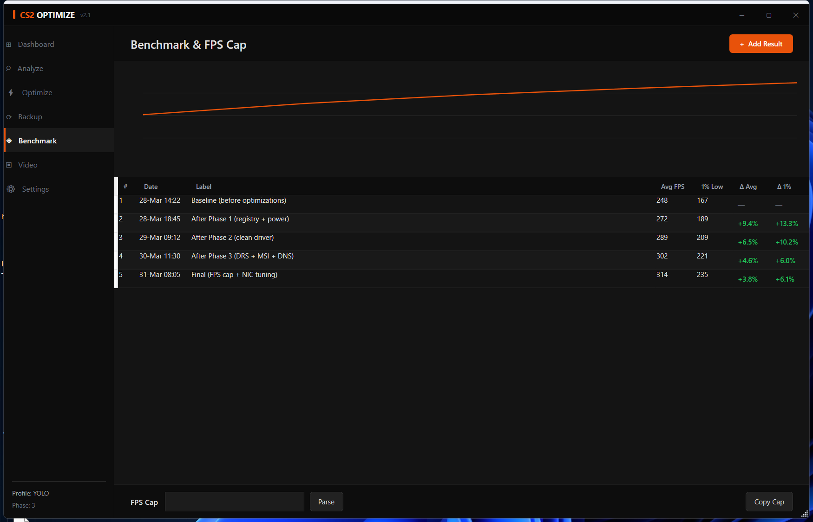
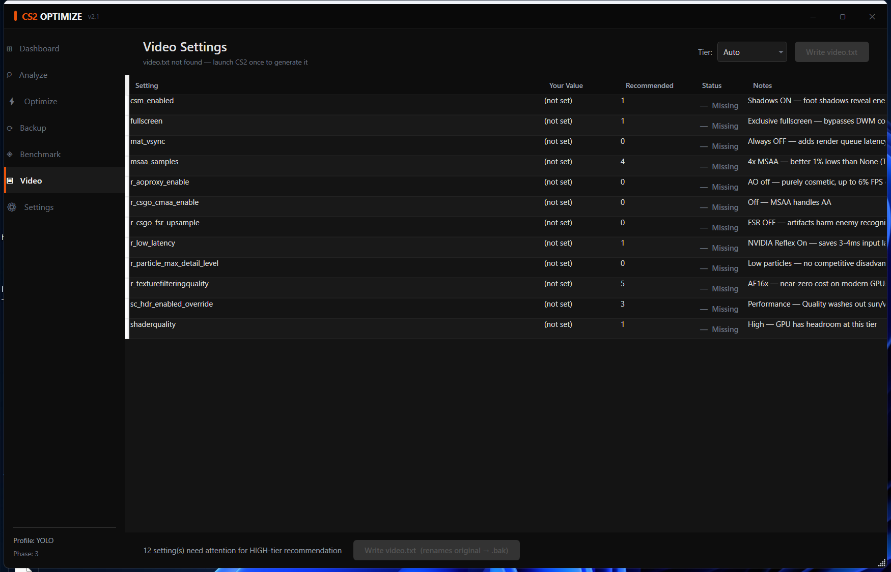
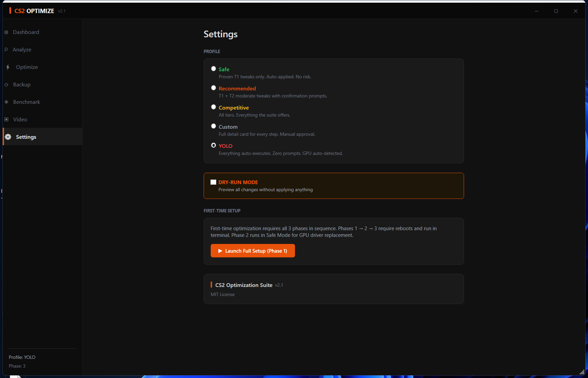

# CS2 Windows 11 Optimization Suite


> **Evidence-based Counter-Strike 2 performance optimization for Windows 11.**
> Every tweak is categorized by what the data actually shows — not what the community assumes.

---

## Table of Contents

- [Philosophy](#philosophy)
- [Important Disclaimer](#important-disclaimer)
- [Profile System](#profile-system)
- [What It Cannot Fix](#what-it-cannot-fix)
- [Requirements](#requirements)
- [Quick Start](#quick-start)
- [GUI Dashboard](#gui-dashboard)
- [File Overview](#file-overview)
- [Phase Breakdown](#phase-breakdown)
- [Key Engineering Decisions](#key-engineering-decisions)
- [Zero External Tools](#zero-external-tools)
- [The Reflex Controversy](#the-reflex-controversy)
- [FPS Cap Calculator](#fps-cap-calculator)
- [Network Condition CFGs](#network-condition-cfgs)
- [Cleanup Modes](#cleanup-modes)
- [Undo / Rollback](#undo--rollback)
- [Deep Dives](#deep-dives)
- [Sources & References](#sources--references)
- [FAQ](#faq)

---

## Philosophy

Most CS2 optimization guides present every tweak as equally impactful — and almost none cite benchmarks. This suite takes a different approach:

We only claim what we can back up.

If a setting has been measured and reproduced, we say so. If it's community consensus without hard data, we say that too. If the evidence is contradicted by newer testing, we tell you. The goal is to apply high-confidence changes first, measure the result, and decide from there.

---

## Important Disclaimer

> **⚠️ READ BEFORE PROCEEDING**
>
> All improvement estimates are **theoretical maximums** from isolated benchmarks. Actual results depend on your specific hardware, current system state, silicon lottery, driver versions, and hardware condition. Real-world gains are typically **30–60% of the theoretical maximum**.
>
> **We take NO RESPONSIBILITY for any damage, data loss, or system instability caused by applying these optimizations. Use at your own risk.** Creating a System Restore Point before running is strongly recommended.

For detailed impact estimates per optimization, see [`docs/evidence.md`](docs/evidence.md).

---

## Profile System

Every step is assigned a **tier** and a **risk level**. Your chosen **profile** determines which steps run automatically, which are prompted, and which are skipped.

| Tier | Standard | | Risk | Meaning |
|------|----------|-|------|---------|
| **T1** | Reproduced benchmark data | | **SAFE** | No system change beyond CS2 |
| **T2** | Measurable but situational | | **MODERATE** | Changes Windows behavior |
| **T3** | Community consensus only | | **AGGRESSIVE** | Disables services; edge cases |
| | | | **CRITICAL** | Security implications |

| Profile | T1 Steps | T2 Steps | T3 Steps | Best For |
|---------|----------|----------|----------|----------|
| **SAFE** | Auto | SAFE risk → auto; else skip | Skip | First-time users, shared PCs |
| **RECOMMENDED** | Auto | ≤ MODERATE → prompted | Skip | Most users (default) |
| **COMPETITIVE** | Auto | ≤ AGGRESSIVE → prompted | ≤ AGGRESSIVE → prompted | Dedicated gaming PCs |
| **CUSTOM** | Prompted (full detail) | Prompted (full detail) | Prompted (full detail) | Expert users |
| **YOLO** | Auto | Auto (≤ AGGRESSIVE) | Auto (≤ AGGRESSIVE) | Experienced users who want zero interaction |

**YOLO** runs every step up to AGGRESSIVE risk without any prompts. CRITICAL steps are still skipped for safety. GPU is auto-detected via WMI, FPS cap defaults to unlimited (0), DNS defaults to Cloudflare. No Read-Host calls, no confirmations, no pauses.

**DRY-RUN** can be combined with any profile — shows what would change without applying anything. `Set-RegistryValue` and `Set-BootConfig` intercept all writes and print them instead.

For detailed per-step behavior under each profile, see the [Step Decision Matrix](docs/evidence.md#step-decision-matrix).

---

## What It Cannot Fix

CS2 has structurally poor frame pacing in Valve's Source 2 engine. Games with significantly higher graphical load — Apex Legends, The Finals, Warzone — produce better 1% lows on the same hardware. Most of the improvement ceiling for 1% lows is set by your **CPU single-core performance** and **Valve's code quality**. Everything else is optimization at the margins.

---

## Requirements

- Windows 10 1903+ or Windows 11 (tested on Win11 22H2, 23H2, 24H2)
- PowerShell 5.1+ (shipped with Windows 10/11)
- Administrator rights (x64 desktop edition)
- NVIDIA GPU for full feature set (AMD/Intel Arc supported with reduced steps)
- Active internet for NVIDIA driver download only

**Graceful degradation:** ARM64, Constrained Language Mode, Windows Server/LTSC, and PowerShell 7 are detected at startup with automatic fallbacks. See `Test-SystemCompatibility` in `helpers/system-utils.ps1`.

> **Recommended:** Create a System Restore Point before running Phase 1.

---

## Quick Start

**Option A — GUI Dashboard** *(recommended for first-time users)*
1. Extract the ZIP to any folder (e.g. `C:\CS2_OPT_SETUP\`)
2. Right-click `START-GUI.bat` → **Run as administrator**
3. Use the dashboard to analyze your system, review backups, and launch optimization phases

**Option B — Terminal** *(full optimization flow)*
1. Extract the ZIP to any folder
2. Right-click `START.bat` → **Run as administrator**
3. Select `[1] Start / Resume Optimization` → choose your profile → follow on-screen instructions

> Phase 1 ends with a Safe Mode reboot. Phase 2 removes GPU drivers natively. Phase 3 installs clean drivers and finishes. Everything is resumable if interrupted.

---

## GUI Dashboard

`START-GUI.bat` → Run as administrator

Seven panels: **Dashboard** (hardware summary, progress), **Analyze** (40+ setting health scan), **Optimize** (step catalog reference), **Backup** (per-step restore), **Benchmark** (FPS history + cap calculator), **Video** (video.txt comparison + one-click write), **Settings** (profile/mode config).

| | | |
|---|---|---|
|  |  |  |
|  |  |  |

The GUI does not run optimizations — Phases 1–3 use the terminal. The dashboard handles analysis, backup, benchmarking, and configuration.

For full panel documentation, see [`docs/gui.md`](docs/gui.md).

---

## File Overview

```
CS2-Optimize-Suite/
├── START.bat                  Main menu (run as Administrator)
├── START-GUI.bat              WPF dashboard launcher
├── CS2-Optimize-GUI.ps1       WPF dashboard
├── config.env.ps1             Central config (paths, maps, NIC, DNS, autoexec CVars)
├── helpers.ps1                Module loader
├── helpers/
│   ├── backup-restore.ps1     Auto-backup + per-step rollback
│   ├── benchmark-history.ps1  Before/after benchmark tracking
│   ├── debloat.ps1            Native system debloat
│   ├── gpu-driver-clean.ps1   Native GPU driver removal (replaces DDU)
│   ├── gui-panels.ps1         WPF panel builders for GUI dashboard
│   ├── hardware-detect.ps1    RAM, CPU, GPU detection
│   ├── logging.ps1            Output formatting
│   ├── msi-interrupts.ps1     MSI interrupt configuration
│   ├── nvidia-driver.ps1      Driver download + silent install
│   ├── nvidia-drs.ps1         C# P/Invoke to nvapi64.dll for DRS
│   ├── nvidia-profile.ps1     Native NVIDIA profile (replaces Profile Inspector)
│   ├── power-plan.ps1         Native tiered power plan (replaces FPSHeaven .pow)
│   ├── process-priority.ps1   IFEO priority + CCD affinity (replaces Process Lasso)
│   ├── step-state.ps1         Progress tracking (state.json / progress.json)
│   ├── step-catalog.ps1       Step metadata for GUI
│   ├── system-analysis.ps1    Health checks for GUI Analyze panel
│   ├── system-utils.ps1       Registry, boot config, utilities
│   └── tier-system.ps1        Profile execution + risk system
├── Run-Optimize.ps1           Full optimization run (38 steps)
├── Setup-Profile.ps1          Profile selection + configuration
├── Optimize-SystemBase.ps1    Steps 2-9: XMP, shader, FSE, driver, power, HAGS, pagefile
├── Optimize-Hardware.ps1      Steps 10-22: Timer, MPO, debloat, NIC, benchmark, GPU prep
├── Optimize-RegistryTweaks.ps1 Steps 23-33: Fast Startup, scheduler, mouse, Game DVR
├── Optimize-GameConfig.ps1    Steps 34-38: Autoexec, chipset, services, Safe Mode prep
├── SafeMode-DriverClean.ps1   Safe Mode: native GPU driver removal
├── PostReboot-Setup.ps1       Post-reboot: 13 steps (driver install, profile, DNS, etc.)
├── Guide-VideoSettings.ps1    Video settings guide
├── FpsCap-Calculator.ps1      Benchmark → FPS cap
├── Verify-Settings.ps1        Post-update registry check
├── Cleanup.ps1                Three-mode soft reset
├── cfgs/
│   ├── autoexec.cfg.example   Annotated 2026 meta autoexec reference (164 CVars, 13 categories)
│   ├── net_stable.cfg         Optimal — stable wired/fiber (also use to reset)
│   ├── net_highping.cfg       60ms+ ping, stable route
│   ├── net_unstable.cfg       Jitter + loss, ping OK
│   └── net_bad.cfg            High ping + jitter/loss
└── docs/                      Deep-dive documentation (17 files — see below)
```

All state is stored in `C:\CS2_OPTIMIZE\`. Logs in `C:\CS2_OPTIMIZE\Logs\`. Backups in `C:\CS2_OPTIMIZE\backup.json`.

---

## Phase Breakdown

### Phase 1 — Normal Boot (38 Steps)

`START.bat → [1]` — standard Windows boot required.

| Step | Action | Tier | Risk | What It Does |
|------|--------|------|------|-------------|
| 1 | Profile + config selection | — | — | Cores, GPU, avg FPS → `state.json` |
| 2 | XMP/EXPO check | T1 | SAFE | Warns if RAM at JEDEC default instead of rated speed |
| 3 | CS2 + GPU shader cache wipe | T1 | SAFE | Finds Steam path via registry; clears stale compiled shaders |
| 4 | Fullscreen Optimizations off | T1 | SAFE | `AppCompatFlags\Layers` = `~ DISABLEDXMAXIMIZEDWINDOWEDMODE` for cs2.exe |
| 5 | NVIDIA driver version check | T2 | AGGRESSIVE | R570+ regression warning (566.36 stable fallback) |
| 6 | CS2 Optimized Power Plan | T1 | MODERATE | Tiered `powercfg` calls: T1 (9 settings), T2 (+15–16 vendor-aware), T3 (+5 C-states). 4 bugs fixed from FPSHeaven original |
| 7 | HAGS toggle | T2 | MODERATE | HwSchMode registry; 2026: ON for RTX 40/50 post-MPO removal. Older GPUs: test both |
| 8 | Pagefile fixed size | T2 | MODERATE | Auto-skipped if ≥32 GB RAM |
| 9 | Resizable BAR / SAM | T2 | SAFE | BIOS guide only — no PowerShell changes |
| 10 | Dynamic Tick + Platform Timer | T3 | MODERATE | `bcdedit /set disabledynamictick Yes` + `useplatformtick Yes` |
| 11 | MPO disabled | T3 | SAFE | `OverlayTestMode = 5` — prevents DWM multiplane overlay microstutter |
| 12 | Game Mode enabled | T3 | SAFE | `AutoGameModeEnabled=1` — WU suppression + MMCSS Games priority (2026 reversal) |
| 13 | Gaming Debloat (native) | T2 | MODERATE | AppX removal + telemetry task/service disable |
| 14 | Autostart cleanup | T2 | SAFE | Configurable list in `config.env.ps1` |
| 15 | Windows Update Blocker | T3 | CRITICAL | Security risk — CUSTOM profile only |
| 16 | NIC latency stack | T2 | MODERATE | 6-layer: PHY power-save off, ITR Medium, RSS off Core 0, URO off (Win11), DSCP EF=46 + NLA key, IPv6 left enabled |
| 17 | Baseline benchmark | T1 | SAFE | CapFrameX capture for before/after comparison |
| 18 | GPU driver clean prep | T1 | SAFE | Prepares native driver removal for Phase 2 |
| 19 | NVIDIA driver download | T1 | SAFE | Downloads driver .exe from nvidia.com |
| 20 | NVIDIA profile prep | T3 | SAFE | Prepares 52-setting DRS profile for Phase 3 |
| 21 | MSI interrupts prep | T2 | SAFE | Prepares MSI config for Phase 3 |
| 22 | NIC interrupt affinity prep | T3 | SAFE | Prepares NIC affinity for Phase 3 |
| 23 | Disable Fast Startup | T2 | SAFE | `HiberbootEnabled=0` — critical for MSI interrupt persistence across reboots |
| 24 | Dual-channel RAM detection | T1 | SAFE | Warns + guides if single-channel detected |
| 25 | Nagle's Algorithm disable | T2 | SAFE | `TcpNoDelay=1` + `TcpAckFrequency=1` on active NIC |
| 26 | GameConfigStore FSE | T2 | SAFE | `GameDVR_FSEBehavior=2`, `HonorUserFSEBehaviorMode=1` |
| 27 | System scheduling + latency | T2 | SAFE | MMCSS `SystemResponsiveness=10`, `Win32PrioritySeparation=0x2A` (short fixed quantum), FTH off, Maintenance off, NTFS metadata off, Intel PowerThrottlingOff (auto-detected) |
| 28 | Timer resolution | T2 | SAFE | `GlobalTimerResolutionRequests=1` |
| 29 | Mouse acceleration off | T2 | SAFE | `MouseSpeed/Threshold=0`, mouclass `MouseDataQueueSize=50` |
| 30 | CS2 GPU preference | T2 | SAFE | Ensures discrete GPU on iGPU+dGPU systems |
| 31 | Game Bar / Game DVR off | T2 | SAFE | `AppCaptureEnabled=0`, `GameDVR_Enabled=0`, `AllowGameDVR=0` |
| 32 | Overlay disable | T2 | SAFE | Steam `GameOverlayDisabled=1` + GeForce Experience guide |
| 33 | Audio optimization | T2 | SAFE | Exclusive mode guide + `UserDuckingPreference=3` (ducking off) |
| 34 | Autoexec.cfg + launch options | T2 | SAFE | 74 CVars (10 categories), 4 network CFGs deployed, Intel `thread_pool_option=2` auto-detected |
| 35 | Chipset driver check | T2 | SAFE | AMD/Intel chipset update links |
| 36 | Visual effects + Defender + HDR | T3 | SAFE | `VisualFXSetting=2`, cs2.exe Defender exclusion, `AutoHDREnabled=0` |
| 37 | Services disable | T3 | MODERATE | SysMain, WSearch, qWave (DSCP survives), 4 Xbox services (warns about wireless controllers) |
| 38 | Safe Mode boot | T1 | SAFE | Phase 2 `RunOnce` registered; mandatory reboot |

### Phase 2 — Safe Mode (Native Driver Removal)

Runs automatically from `RunOnce`. No manual start needed.

1. Remove Safe Mode boot flag (`bcdedit /deletevalue safeboot`)
2. Native GPU driver removal — stops services, `pnputil /delete-driver`, registry cleanup, shader cache wipe (equivalent to DDU, fully auditable)
3. Register Phase 3 via RunOnce

### Phase 3 — Final Setup (13 Steps)

Runs automatically on the first normal boot after driver removal.

| Step | Action | Tier | Risk | What It Does |
|------|--------|------|------|-------------|
| 1 | NVIDIA driver install (clean) | T1 | SAFE | Extracted .exe, 15 bloat components removed, silent `setup.exe -s` |
| 2 | MSI Interrupts | T2 | MODERATE | `MSISupported=1` for GPU, NIC, Audio — line-based → Message Signaled |
| 3 | NIC interrupt affinity | T3 | MODERATE | `DevicePolicy=4` + `AssignmentSetOverride` — moves NIC DPCs off Core 0 |
| 4 | NVIDIA CS2 Profile | T3 | SAFE | 52 DWORD settings via `nvapi64.dll` DRS direct write (not registry — see Key Decisions) |
| 5 | FPS cap info | — | — | Benchmark map links + methodology |
| 6 | Launch options + video settings | — | — | `-console +exec autoexec` + video.txt tier guide |
| 7 | VBS / Core Isolation disable | T2 | MODERATE | Disables Memory Integrity (HVCI) — removes 5–15% CPU overhead on OEM Win11. Skip if FACEIT/Vanguard. |
| 8 | AMD GPU settings (AMD only) | T2 | SAFE | Manual Radeon Software guide |
| 9 | DNS server configuration | T3 | SAFE | Configurable in `config.env.ps1` |
| 10 | Process priority / CCD affinity | T3 | SAFE | IFEO `CpuPriorityClass=3` (High) + X3D CCD scheduled task (dual-CCD only) |
| 11 | VRAM leak awareness | — | — | CS2-specific VRAM leak warning |
| 12 | Final checklist | — | — | Summary of applied optimizations |
| 13 | Final benchmark + FPS cap | T1 | SAFE | Compares against Step 17 baseline; stores in `benchmark_history.json` |

---

## Key Engineering Decisions

The step tables tell you *what* the suite does. This section explains the *why* behind the most interesting non-obvious decisions. Each links to its full deep-dive.

### NVIDIA DRS: Why Registry Writes Don't Work on Modern Drivers

Most "NVIDIA optimization" guides write to `HKLM:\SOFTWARE\NVIDIA Corporation\Global\d3d\`. This is mostly ineffective. Since ~driver 460+, NVIDIA reads per-application settings from the **DRS binary database** (`nvdrs.dat`), not the `d3d` registry path. The only confirmed-effective registry write is `PerfLevelSrc=0x2222` in the GPU hardware class key (`{4d36e968}\0000`), which locks the GPU to max P-state. Everything else must go through DRS.

The suite uses C# P/Invoke to `nvapi64.dll` — `nvapi_QueryInterface()` resolves 12 DRS function pointers for direct binary database writes. Same API that NVIDIA Profile Inspector uses, zero external tools. → [`docs/nvidia-drs-settings.md`](docs/nvidia-drs-settings.md)

### Power Plan: 4 Bugs Fixed in the FPSHeaven Original

The FPSHeaven 2026 power plan shipped with four bugs we identified and corrected:

1. **Passive cooling** (`SYSCOOLPOL=0`) — tells Windows to throttle CPU *before* ramping fans. Fixed to Active (1).
2. **AMD CPU min 100%** — locks Ryzen at max frequency, bypassing Precision Boost 2's superior boost algorithm. Fixed to 0% on AMD (PB2 gets full control while EPP=0 prioritizes performance).
3. **Duty cycling enabled** — inserts mandatory 5ms frequency reduction pauses near thermal limits, creating frametime spikes. Fixed to Off.
4. **`PERFAUTONOMOUS=0`** — disables hardware P-state feedback on AMD CPPC2, making the OS guess frequencies instead of the CPU firmware. Left at default.

Settings are tiered: T1 (9 settings, always), T2 (+15–16 vendor-aware, RECOMMENDED+), T3 (+5 C-states/ramp, COMPETITIVE+). → [`docs/power-plan.md`](docs/power-plan.md)

### NIC Interrupt Coalescing: Why Medium Beats Disabled

Intuitively, per-packet interrupts (Disabled) should be better than coalesced delivery (Medium). Empirically, the opposite is true. djdallmann measured DPC latency variance on an Intel Gigabit CT and found Medium produced the lowest variance under real-world conditions.

The reason: a gaming PC always has background network traffic (Discord, Steam, Windows telemetry). With Disabled, each background packet fires a separate interrupt, creating an interrupt storm that makes DPC scheduling *less* predictable. Medium coalesces within ~50–200µs — well within CS2's 7.8ms tick interval — but prevents the storm. The suite uses **Medium for all profiles**, rejecting the intuitive-but-wrong recommendation found in most guides. → [`docs/nic-latency-stack.md`](docs/nic-latency-stack.md)

### Game Mode: Why We Enable It (2026 Reversal)

Many 2020–2022 guides recommended disabling Game Mode, citing valleyofdoom/PC-Tuning findings about "thread priority interference." This has not been reproduced in CS2 benchmarks and is overridden by a more important benefit: Game Mode suppresses Windows Update installation during active gaming. It also activates the MMCSS `Games` scheduling path. Critically, Game Mode and Game DVR/Bar are *separate systems* despite the same Settings panel — Step 31 disables DVR (recording overhead), Step 12 enables the scheduler's game-priority path. → [`docs/windows-scheduler.md`](docs/windows-scheduler.md)

### NetworkThrottlingIndex: Why We Do NOT Set It

This appears in virtually every community guide as `NetworkThrottlingIndex = 0xFFFFFFFF` (disable throttling). We deliberately leave it at the Windows default (10). djdallmann's xperf/ETL analysis found that disabling it **increases NDIS.sys DPC latency**. The "10 Mbps cap" narrative originated from a Windows Vista-era blog post about multimedia streaming. On modern NICs, removing the throttle increases interrupt coalescing variability. → [`docs/windows-scheduler.md`](docs/windows-scheduler.md)

### IFEO PerfOptions: Why It Beats `-high`

The `-high` launch option raises CS2's priority after the process starts, and resets to Normal on exit. IFEO (Image File Execution Options) writes `CpuPriorityClass=3` (High) to `HKLM:\...\Image File Execution Options\cs2.exe\PerfOptions` — the kernel applies this *at process creation time*, before the entry point runs. Zero race condition, zero overhead, survives reboots. This is the same mechanism Xbox Game Bar profiles use internally. Process Lasso's "persistent priority" is a background service doing the same thing worse (ETW monitoring + `SetPriorityClass()` after startup, ~30MB RAM). → [`docs/process-priority.md`](docs/process-priority.md)

### Fast Startup: Why Disabling It Is Critical for MSI

Windows Fast Startup (`HiberbootEnabled=1`) writes a hibernation snapshot on shutdown. On next boot, Windows restores the snapshot instead of cold-booting. Problem: MSI interrupt registry changes (`MSISupported=1`) require device re-enumeration during a true cold boot. Fast Startup's snapshot preserves the old interrupt routing, making your MSI changes ineffective until the next full restart. `HiberbootEnabled=0` forces every shutdown to be a real shutdown.

### IPv6: Why We Leave It Enabled (2026 Reversal)

Previous guidance (2023–2024) recommended disabling IPv6 to eliminate NDP/RA background traffic. 2025–2026 evidence reverses this: Steam prefers IPv6 when round-trip time is lower, Valve's SDR relay network supports IPv6, and **disabling IPv6 can force traffic through IPv4 CGNAT gateways adding 5–15ms** on many consumer ISPs. The NDP overhead (<1 packet/sec) is trivial compared to the routing benefit. → [`docs/nic-latency-stack.md`](docs/nic-latency-stack.md)

---

## Zero External Tools

Every external tool was replaced with native PowerShell. Only the NVIDIA driver `.exe` is downloaded.

| Previously | Replaced By | Module |
|---|---|---|
| DDU (Wagnardsoft) | 5-phase PowerShell driver removal (`pnputil`, registry, shader cache) | `gpu-driver-clean.ps1` |
| NVCleanstall (TechPowerUp) | Native driver extract + 15-component bloat removal + silent install | `nvidia-driver.ps1` |
| NVIDIA Profile Inspector | C# P/Invoke to `nvapi64.dll` — 52 DRS DWORD writes to binary database | `nvidia-drs.ps1` + `nvidia-profile.ps1` |
| MSI Utility v3 (Sathango) | Native `MSISupported=1` registry writes per device class | `msi-interrupts.ps1` |
| GoInterruptPolicy (spddl) | Native `DevicePolicy=4` + `AssignmentSetOverride` registry writes | `msi-interrupts.ps1` |
| Win11Debloat (Raphire) | `Get-AppxPackage \| Remove-AppxPackage` + telemetry registry | `debloat.ps1` |
| FPSHeaven `.pow` binary | Native `powercfg /setacvalueindex` (4 bugs fixed, vendor-aware) | `power-plan.ps1` |
| Process Lasso (Bitsum) | IFEO `CpuPriorityClass=3` + scheduled task for X3D CCD affinity | `process-priority.ps1` |

---

## The Reflex Controversy

The most actively contested CS2 setting as of 2026. Do not treat either side as settled.

**Position A — `-noreflex` + NVCP Low Latency Ultra:** Community meta since Jan 2025 (Blur Busters, ThourCS2). Multiple benchmarks showed better 1% lows. Critical caveat: @CS2Kitchen (July 2025) demonstrated that CapFrameX builds using PresentMon 2.2+ produce misleading 1% low data in this configuration — **the improvement may be a measurement artifact**.

**Position B — Reflex ON:** ThourCS2 (driver 581.08): 3–4ms lower input lag on high-end, up to 15ms on low-end. 1% low difference negligible (±0.5%). Valve and NVIDIA both recommend Reflex enabled.

**The suite's approach:** Present both options, ask the user to benchmark both on their hardware, pick whichever produces better numbers *and* feels better. → [`docs/video-settings.md`](docs/video-settings.md)

---

## FPS Cap Calculator

Without a cap, the GPU runs at max utilization and frame delivery becomes irregular. A cap below your average keeps the GPU at steady utilization, producing more consistent frametimes and better 1% lows. This is one of the few CS2 optimizations with clear, reproducible benchmark data.

**Method:** `avg FPS × 0.91` (FPSHeaven / Blur Busters). The 9% headroom prevents GPU ceiling hits in demanding scenes. Use the **NVCP frame cap**, not CS2's `fps_max` (less accurate, higher frametime variance).

Benchmark maps: [Dust2](https://steamcommunity.com/sharedfiles/filedetails/?id=3240880604) · [Inferno](https://steamcommunity.com/sharedfiles/filedetails/?id=2932674700) · [Ancient](https://steamcommunity.com/sharedfiles/filedetails/?id=3472126051). Run 3 times, average, then `START.bat → [3]`.

**P1/Avg ratio:** ≥0.40 = good frametime consistency, 0.30–0.39 = acceptable, <0.30 = investigate thermal throttling, DPC latency, or GPU bottleneck.

---

## Network Condition CFGs

Step 34 deploys four condition-specific CFGs to `game\csgo\cfg\`. These are not auto-exec'd — call them from the CS2 console when your connection changes. The four CFGs map to a 2×2 matrix of the two independent failure modes:

| | **Stable route** | **Unstable route (jitter / loss)** |
|---|---|---|
| **Low ping** | `exec net_stable` | `exec net_unstable` |
| **High ping (60ms+)** | `exec net_highping` | `exec net_bad` |

**`cl_interp_ratio`** controls the rendering interpolation window — how many tick intervals the client can bridge. Setting 2 makes a single dropped packet invisible (trade-off: ~7.8ms positional lag). **`cl_net_buffer_ticks`** is a CS2 receive buffer — holds N ticks and drains at steady rate, absorbing jitter (trade-off: +N×7.8ms round-trip delay).

Always `exec net_stable` when back on a good connection. → [`docs/network-cfgs.md`](docs/network-cfgs.md)

---

## Cleanup Modes

`START.bat → [2] Cleanup / Soft-Reset`

| Mode | Time | What It Clears |
|------|------|----------------|
| **Quick Refresh** | ~2 min | Shader cache, temp, DNS, RAM working set |
| **Full Cleanup** | ~5 min | + NVIDIA/AMD/DX caches, Prefetch, Event Logs, Winsock reset |
| **Driver Refresh** | ~20 min | + Native driver removal + reinstall (Phases 2+3) |

Use **Full Cleanup** after any Windows or GPU driver update (shader cache invalidation). **Quick Refresh** for routine pre-match maintenance.

---

## Undo / Rollback

Every modification is automatically backed up before application — registry values (original + type + existence), service start types, boot config entries, power plan GUID, DRS per-setting previous values, scheduled task state. All stored in `C:\CS2_OPTIMIZE\backup.json`, tagged by step title and timestamp.

Access via `START.bat → [7] Restore / Rollback` — per-step rollback or full restore. The GUI **Backup** panel provides the same functionality with a visual interface.

For manual rollback reference, backup format details, and all 6 backup types, see [`docs/backup-restore.md`](docs/backup-restore.md).

---

## Deep Dives

The README covers the *what*. These docs cover the *why* — architecture decisions, research methodology, and implementation details.

| Document | Covers |
|----------|--------|
| [`docs/evidence.md`](docs/evidence.md) | Per-optimization impact estimates, cumulative improvement, risk trade-off analysis, full step decision matrix |
| [`docs/debunked.md`](docs/debunked.md) | 40+ debunked settings with evidence, contested optimizations, AMD Anti-Lag history, known limitations |
| [`docs/gui.md`](docs/gui.md) | GUI dashboard panels, interaction details, layout examples |
| [`docs/audio.md`](docs/audio.md) | HRTF dependency chain (`speaker_config` → `snd_use_hrtf` → `snd_spatialize_lerp`), headphone EQ pro study, ducking, voice CVars |
| [`docs/video-settings.md`](docs/video-settings.md) | 2026 competitive meta per setting, why MSAA 4x beats None, video.txt vs autoexec, Reflex deep-dive |
| [`docs/network-cfgs.md`](docs/network-cfgs.md) | Connection condition 2×2 matrix, `cl_interp_ratio` (loss) vs `cl_net_buffer_ticks` (jitter), why `net_bad` uses 3 ticks not 4 |
| [`docs/nic-latency-stack.md`](docs/nic-latency-stack.md) | 6-layer NIC stack: PHY wake latency, interrupt coalescing empirical results, RSS core assignment, URO, QoS DSCP + NLA trap, IPv6 reversal |
| [`docs/msi-interrupts.md`](docs/msi-interrupts.md) | Line-based vs MSI/MSI-X delivery, why cold boot is required, NIC Core 0 contention, RSS queue distribution |
| [`docs/windows-scheduler.md`](docs/windows-scheduler.md) | MMCSS, Game Mode reversal, `Win32PrioritySeparation` (Variable→Fixed, Blur Busters 2025), FTH heap slowdown, Automatic Maintenance CPU spike, Intel PowerThrottling auto-detection |
| [`docs/process-priority.md`](docs/process-priority.md) | IFEO kernel mechanism, why it beats `-high` and Process Lasso, X3D CCD topology (dual-CCD only), affinity mask calculation, task design |
| [`docs/nvidia-optimization.md`](docs/nvidia-optimization.md) | DRS binary database vs `d3d\` registry path, clean driver install methodology, R570 regression |
| [`docs/nvidia-drs-settings.md`](docs/nvidia-drs-settings.md) | All 52 DRS settings: IDs, values, decoded meanings, 13-section breakdown (incl. rBAR), registry keys, 3 excluded settings |
| [`docs/power-plan.md`](docs/power-plan.md) | 4 FPSHeaven bugs, AMD CPPC2 vs Intel branching, EPP mechanics, PCIe ASPM, NVMe APST, C-state depth vs wake latency |
| [`docs/services.md`](docs/services.md) | Per-service justification (SysMain, WSearch, qWave, 4 Xbox), Xbox wireless controller warning, re-enable commands |
| [`docs/debloat.md`](docs/debloat.md) | Full AppX removal list with rationale, telemetry service/task disable, what is NOT removed |
| [`docs/backup-restore.md`](docs/backup-restore.md) | `backup.json` structure, all 6 backup types (registry, service, bootconfig, powerplan, drs, scheduledtask), manual restore |
| [`docs/video.txt`](docs/video.txt) | Copy-ready annotated CS2 `video.txt` with 2026 meta values for Low / Mid / High GPU tiers |

---

## Sources & References

| Source | Used For |
|--------|----------|
| [Blur Busters Forum](https://forums.blurbusters.com) | Reflex controversy, EXPO testing, FPS cap methodology, `Win32PrioritySeparation` Fixed quantum finding |
| [ThourCS2](https://x.com/ThourCS2) | Video setting benchmarks (MSAA, AO, shadows, Boost Player Contrast), driver testing |
| [@CS2Kitchen](https://x.com/iamcs2kitchen/status/1947988323584405780) | CapFrameX PresentMon 2.2+ measurement artifact disclosure |
| [fREQUENCYcs / FPSHeaven](https://fpsheaven.com) | Power plan (original .pow, which we decoded and bug-fixed), FPS cap formula, benchmark maps |
| [valleyofdoom/PC-Tuning](https://github.com/valleyofdoom/PC-Tuning) | MPO, timer resolution, MSI interrupts, `tscsyncpolicy` WinDbg analysis, general Windows optimization |
| [djdallmann/GamingPCSetup](https://github.com/djdallmann/GamingPCSetup) | NIC interrupt coalescing empirical test, MMCSS/NetworkThrottlingIndex xperf, FTH analysis, Automatic Maintenance CPU measurement, PS/2 vs USB DPC |
| [prosettings.net](https://prosettings.net/guides/cs2-options/) | Pro settings aggregation (866 players), damage prediction study |
| [Orbmu2k/nvidiaProfileInspector](https://github.com/Orbmu2k/nvidiaProfileInspector) | `NvApiDriverSettings.h` + `CustomSettingNames.xml` for DRS setting decode |
| [CXWorld/CapFrameX](https://github.com/CXWorld/CapFrameX) | Benchmark measurement tool |

---

## FAQ

**Q: Do I need to run all three phases?**
Yes. Phase 1 prepares + benchmarks. Phase 2 removes drivers in Safe Mode. Phase 3 installs clean drivers + final settings. They're designed as a sequence.

**Q: Can I run it multiple times?**
Yes. The resume system (`progress.json`) tracks completed steps. Restart mid-phase or re-run cleanup at any time.

**Q: What is DRY-RUN?**
A modifier on any profile. `Set-RegistryValue` and `Set-BootConfig` intercept all writes and print what would change instead of applying. Full profile skip/prompt/auto logic preserved.

**Q: My NVIDIA driver is R570+. Roll back?**
Only if you have observable stutter absent on earlier drivers. The script offers the option; stable pre-R570 is 566.36 as of early 2026.

**Q: XMP/EXPO — does it matter?**
Activate it — it's free and your RAM should run at rated speed. But the CS2-specific 1% low benefit has not been isolated in controlled testing (one Blur Busters 7800X3D + 4070 Super test showed identical results). After activating, run TM5 or HCI MemTest to confirm stability. See [`docs/evidence.md`](docs/evidence.md#known-limitations--evidence-gaps).

**Q: AMD / Intel Arc support?**
AMD is supported for most steps. NVIDIA-specific steps (DRS profile, driver install) are skipped automatically. Intel Arc partially supported. **AMD gap:** No public API equivalent to `nvapi64.dll` DRS for AMD per-game profiles. Manually set Radeon Software → CS2 profile: disable Chill/Boost, AF/AA to App Settings, Power Efficiency to Max Performance.

**Q: How do I undo everything?**
`START.bat → [7] Restore / Rollback`. Every change is backed up automatically — registry, services, boot config, power plan, DRS settings, scheduled tasks. Roll back individual steps or everything.

**Q: My 1% lows are still bad.**
Check in order: (1) XMP/EXPO active? Task Manager → Memory → Speed. (2) CPU thermal throttling? HWiNFO64 during match. (3) DPC latency? LatencyMon 10-minute idle run. (4) GPU at 99% at low points? Raise FPS cap. If none, it's likely the CS2 engine itself — see [What It Cannot Fix](#what-it-cannot-fix).

**Q: How accurate are improvement estimates?**
Theoretical maximums. Real-world: 30–60% of stated values. A bloated system sees large gains; a clean install may see almost nothing. Always benchmark. See [`docs/evidence.md`](docs/evidence.md).

**Q: What settings do YouTube guides recommend that you skip?**
Over 40 commonly-recommended settings are debunked with evidence in [`docs/debunked.md`](docs/debunked.md) — including `-tickrate 128`, `NetworkThrottlingIndex=0xFFFFFFFF`, interrupt moderation Disabled, `useplatformclock true`, `-threads N`, and all TCP-only "network optimizations" that don't affect CS2's UDP traffic.

---

## License

[MIT License](LICENSE) — use, modify, distribute freely. Contributions welcome.

---

*Last updated: March 2026. Tested on Windows 11 23H2/24H2, NVIDIA RTX 4000/5000 series, AMD Ryzen 7000 series.*
