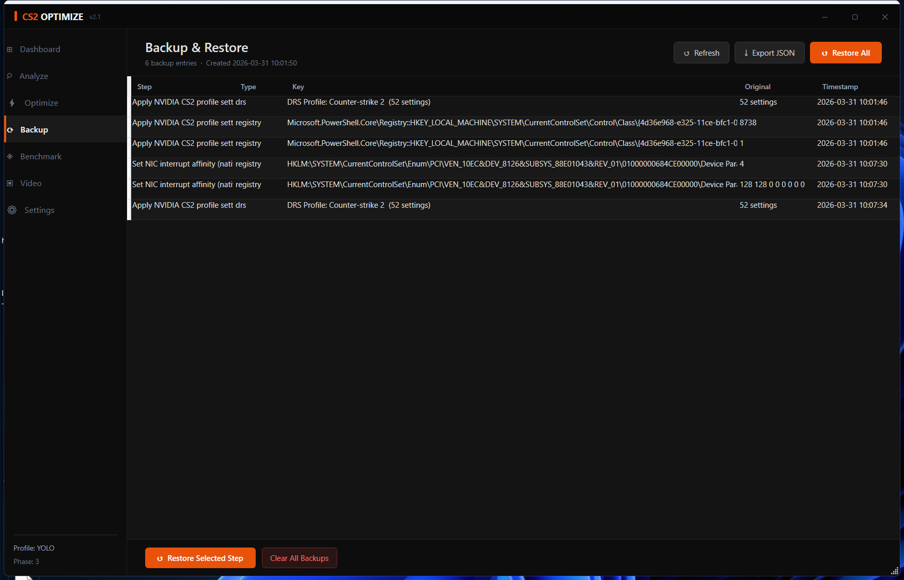

# GUI Dashboard Guide

> `START-GUI.bat` → Run as Administrator

The GUI dashboard is a non-destructive management layer for the optimization suite. It does not replace the terminal phases — Phase 1, 2, and 3 still run in a terminal window. The dashboard handles everything else: analyzing your current system state, reviewing what has been changed, tracking benchmark results over time, and configuring CS2 video settings.

---

## Launching

```
Right-click START-GUI.bat → Run as administrator
```

If you are not an administrator, the launcher automatically re-elevates via `Start-Process -Verb RunAs`. The dashboard requires admin rights because it reads hardware configuration registers, registry keys under `HKLM`, and system service states.

---

## Panel Overview

### Dashboard

The first screen after launch. Shows the current state of your system at a glance.


**Hardware cards** are populated asynchronously on first open (~1 second). They show CPU model, GPU model and VRAM, RAM size and detected speed, and Windows build.

**Phase Progress** reads `C:\CS2_OPTIMIZE\progress.json`. If you have not run any phases yet, all bars show 0%.

**Benchmark summary** shows the most recent result from `benchmark_history.json`. Ratio = P1/Avg; values above 0.40 indicate good frametime consistency.

**Quick action buttons** launch the terminal phases in a new elevated PowerShell window. The dashboard remains open while the terminal runs. Cleanup runs `Cleanup.ps1` in Quick Refresh mode.

---

### Analyze

Runs a non-destructive system health scan. No changes are made. Results take 5–15 seconds.


**Status columns:**
- `✓ OK` (green) — matches the recommended value
- `⚠ Check` (yellow) — present but not optimal, or hardware-dependent
- `✗ Off / Missing / Default` (red) — not yet optimized

**Categories covered:** Hardware (dual-channel, XMP, VBS/HVCI), Windows Gaming (HAGS, Game Mode, DVR, Fast Startup, MPO, FSE, Auto HDR), System Latency (MMCSS, Win32PrioritySeparation, DisablePagingExecutive, Timer, FTH, Maintenance, NTFS), Input (mouse acceleration, mouclass queue), Network (Nagle, IPv6, QoS NLA, URO), Services (SysMain, WSearch, Xbox, qWave), CS2 Config (autoexec CVars, video.txt settings, launch options).

**Export CSV** — saves the full results table to `C:\CS2_OPTIMIZE\analysis_<timestamp>.csv`. Useful for before/after comparison or sharing for support.

Each row includes a `StepRef` column showing which step addresses it (e.g., "Phase 1 Step 27") and an `Impact` estimate.

---

### Optimize

Shows the full step catalog — all 38 Phase 1 steps and all 13 Phase 3 steps — with their metadata. This is a read-only reference panel; steps run in the terminal.


**Filters** let you narrow by phase, category (GPU, System, Network, etc.), and risk level. Useful when you want to see only MODERATE+ steps or only Network-category steps.

**Depth column** abbreviations: `FS` = filesystem, `REG` = registry, `NET` = network stack, `DRV` = driver, `SVC` = service, `APP` = application config, `BOOT` = bcdedit, `CHK` = check only.

The phase terminal buttons open a new elevated PowerShell window running `START.bat` pointed at the appropriate phase. The dashboard stays open.

---

### Backup

Shows everything the suite has backed up in `C:\CS2_OPTIMIZE\backup.json`, organized by step.



**Restore Selected** — rolls back only the highlighted step(s). Registry keys are returned to their pre-suite values; services are returned to their original start type; power plans are re-activated; DRS settings are restored per-setting.

**Restore All** — full rollback to pre-suite state. Equivalent to `START.bat → [7] → Full restore`.

**Export** saves a copy of `backup.json` with a timestamped filename. Useful before any major change.

---

### Benchmark

Tracks FPS measurements over time and calculates your optimal NVCP frame cap.


**Chart** — shows Avg FPS (solid line/dots) and P1 FPS (dashed line/dots) across all runs. The canvas is drawn programmatically — no external charting library.

**+ Add Result** — opens a dialog to label the result. If you paste a `[VProf] FPS: Avg=387.2, P1=312.0` line into the text field first, the Avg and P1 values are auto-parsed; you only need to confirm the label.

**FPS Cap Calculator** — paste any `[VProf]` line from the CS2 console into the text field, hit Calc, and the recommended cap is computed (`Avg × 0.91`). Click "Copy cap" to put the value on clipboard for pasting into NVCP.

---

### Video

Compares your current `video.txt` against the recommended values for your hardware tier. Write the optimized file in one click.


**Tier picker** — AUTO (detects NVIDIA GPU presence → HIGH), HIGH, MID, or LOW. The recommended values change based on tier. See [`docs/video-settings.md`](video-settings.md) for the full rationale.

**Write video.txt** — backs up your current file as `video.txt.bak`, then writes the optimized values. Unmanaged keys (your resolution, refresh rate, and any custom settings not in the suite's managed set) are preserved. CS2 must be fully closed for the change to take effect on next launch.

---

### Settings

Configure how the terminal optimization phases behave. These settings persist in `C:\CS2_OPTIMIZE\state.json`.


**Profiles:**
- **SAFE** — Auto-apply proven tweaks only (T1 SAFE steps). Best for first-time users.
- **RECOMMENDED** — Prompt on moderate tweaks. Default for most users.
- **COMPETITIVE** — Prompt on all tweaks including T3/AGGRESSIVE. Dedicated gaming PCs.
- **CUSTOM** — Full detail card for every step. Expert users.
- **YOLO** — Everything auto-executes up to AGGRESSIVE risk. Zero prompts. GPU auto-detected via WMI, FPS cap defaults to unlimited, DNS defaults to Cloudflare. CRITICAL steps are still skipped for safety.

See the [Profile System](../README.md#profile-system) section for the full behavior matrix.

**DRY-RUN** — when on, all registry, boot config, and service writes are replaced by preview messages. The full terminal flow runs but nothing is changed. Safe to use on any profile to preview what would happen.

---

## What the GUI Cannot Do

The GUI is a management dashboard, not a replacement for the terminal phases. The following require the terminal:

| Task | Why terminal only |
|------|------------------|
| Phase 1 (38-step optimization) | Requires reboot into Safe Mode at the end; interactive confirmation at each step (unless YOLO profile) |
| Phase 2 (GPU driver removal in Safe Mode) | Runs automatically from RunOnce in Safe Mode — no GUI is available in Safe Mode |
| Phase 3 (driver install + final steps) | Runs automatically after Phase 2 |
| Cleanup (Quick / Full / Driver Refresh) | Driver Refresh involves Safe Mode reboot |

The GUI does supplement the terminal with:
- Pre-flight system analysis before you run any phases
- Backup review and per-step rollback after running phases
- Benchmark tracking across multiple sessions
- video.txt management independently of the optimization phases

---

## Technical Notes

**Admin requirement:** The dashboard requires elevation to read hardware configuration, HKLM registry keys, and system service states. The `START-GUI.bat` launcher handles this automatically.

**Async model:** Hardware detection, system analysis, and backup loading all run in background RunSpaces (PowerShell thread pool). The UI remains responsive during these operations. A 250ms DispatcherTimer polls for completion and updates the UI thread.

**Scope:** The GUI dot-sources `config.env.ps1` and `helpers.ps1` at startup. The `step-catalog.ps1` and `system-analysis.ps1` helpers are GUI-only and are not loaded in the terminal flow.
